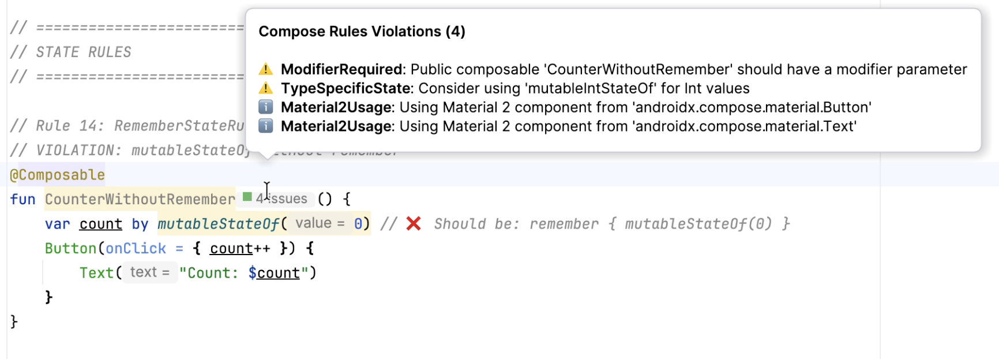
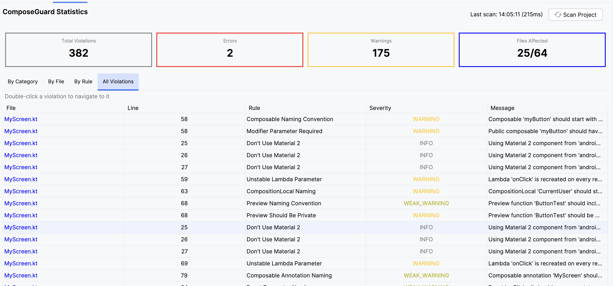
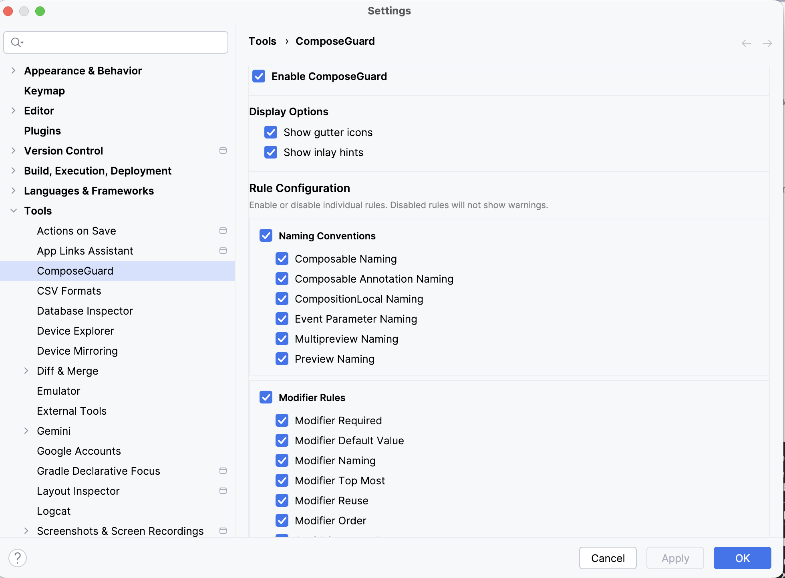

<p align="center">
  
</p>

<h1 align="center">ComposeGuard</h1>

<p align="center">
  <a href="https://plugins.jetbrains.com/plugin/29308-composeguard"></a>
  <a href="https://opensource.org/licenses/Apache-2.0"></a>
  <a href="https://github.com/androidpoet"></a>
</p>

<p align="center">
Real-time detection of Jetpack Compose best practices and rule violations directly in Android Studio.
</p>

---

## Preview

<p align="center">
  
</p>

## Overview

**ComposeGuard** is an IntelliJ/Android Studio plugin that provides real-time detection of Compose best practices violations as you write code. It analyzes your composable functions and highlights issues based on the [Compose Rules](https://mrmans0n.github.io/compose-rules/) documentation.

Instead of waiting for build-time lint checks or runtime issues, you get instant feedback right in your IDE with visual indicators, quick fixes, and detailed explanations.

## Features

### 35 Compose Rules

ComposeGuard implements comprehensive rules across 7 categories:

| Category | Rules |
|----------|-------|
| **Naming** | Composable naming (PascalCase/camelCase), modifier naming, CompositionLocal naming, preview naming, multipreview naming, event parameter naming |
| **Modifiers** | Required modifier parameter, modifier default value, modifier naming, modifier at top-most layout, modifier reuse, modifier order, avoid composed |
| **State** | Remember state, type-specific mutableStateOf, state hoisting, mutable state as parameter |
| **Parameters** | Parameter ordering, trailing lambda for content, mutable types as parameters, explicit dependencies |
| **Composables** | Content emission rules, multiple content slots, effect keys, movable content, preview visibility |
| **Stricter** | Material 2 usage detection, unstable collections (enabled by default) |
| **Experimental** | LazyList missing key, LazyList contentType, derivedStateOf candidate, lifecycle-aware collection (opt-in) |

### IDE Integration

- **Real-time Highlighting**: See violations as you type with colored underlines
- **Gutter Icons**: Color-coded dots showing violation status per composable function
  - 🔴 Red: Error severity violations
  - 🟠 Orange: Warning severity violations
  - ⚫ Gray: Weak warning violations
  - 🟢 Green: Info level violations
- **Inline Hints**: Small badges next to function names showing rule violations
- **Hover Tooltips**: Detailed explanations when hovering over violations
- **Quick Fixes**: One-click fixes for common issues (Alt+Enter)

## Installation

### From JetBrains Marketplace

<a href="https://plugins.jetbrains.com/plugin/29308-composeguard"></a>

[](https://plugins.jetbrains.com/plugin/29308-composeguard)
[](https://plugins.jetbrains.com/plugin/29308-composeguard)

1. Open Android Studio/IntelliJ IDEA
2. Go to **Settings** → **Plugins** → **Marketplace**
3. Search for "ComposeGuard"
4. Click **Install**

Or install directly from: [JetBrains Marketplace - ComposeGuard](https://plugins.jetbrains.com/plugin/29308-composeguard)

## Usage

Once installed, ComposeGuard automatically analyzes your Kotlin files containing `@Composable` functions.

### Example Violations

```kotlin
// ❌ Naming violation: Should be PascalCase
@Composable
fun userCard(user: User) { }  // Warning: Should be "UserCard"

// ❌ Missing modifier parameter
@Composable
fun ProductCard(product: Product) { }  // Warning: Add modifier parameter

// ❌ State not remembered
@Composable
fun Counter() {
    val count = mutableStateOf(0)  // Error: Wrap in remember { }
}

// ❌ Unstable collection parameter
@Composable
fun ItemList(items: List<Item>) { }  // Warning: Use ImmutableList
```

### Quick Fixes Available

- **Rename composable** to follow naming conventions
- **Add modifier parameter** with default value
- **Wrap in remember { }** for state
- **Replace with type-specific state** (mutableIntStateOf, etc.)
- **Make preview private**
- **Use immutable collection**
- **Suppress rule** for intentional violations

## Rule Categories

### Naming Rules

| Rule | Description |
|------|-------------|
| ComposableNaming | Unit-returning composables should use PascalCase, value-returning should use camelCase |
| ModifierNaming | Modifier parameters should be named `modifier` or follow `xModifier` pattern |
| CompositionLocalNaming | CompositionLocal properties should be prefixed with `Local` |
| PreviewNaming | Preview functions should follow naming conventions |
| EventParameterNaming | Event callbacks should follow `onX` naming pattern |

### Modifier Rules

| Rule | Description |
|------|-------------|
| ModifierRequired | Public composables emitting UI should have a modifier parameter |
| ModifierDefaultValue | Modifier parameters should have `= Modifier` default value |
| ModifierTopMost | Modifier should be applied to the top-most layout |
| ModifierReuse | Don't reuse the same modifier across multiple layouts |
| ModifierOrder | Modifier chain order matters for behavior |
| AvoidComposed | Prefer `Modifier.Node` over `composed { }` |

### State Rules

| Rule | Description |
|------|-------------|
| RememberState | State builders (mutableStateOf, etc.) should be wrapped in `remember { }` |
| TypeSpecificState | Use `mutableIntStateOf`, `mutableFloatStateOf`, etc. for primitives |
| HoistState | State should be hoisted to appropriate level |
| MutableStateParameter | Don't pass MutableState as parameter, use value + callback |

### Stricter Rules (Enabled by Default)

| Rule | Description |
|------|-------------|
| Material2Usage | Detects Material 2 imports, suggests migration to Material 3 |
| UnstableCollections | Flags `List`, `Set`, `Map` parameters, suggests `ImmutableList`, etc. |

### Experimental Rules (Opt-in)

Enable in **Settings** → **Tools** → **ComposeGuard** → **Experimental Rules**

| Rule | Description |
|------|-------------|
| LazyListMissingKey | LazyColumn/LazyRow items() should have a `key` parameter for efficient recomposition |
| LazyListContentType | Heterogeneous LazyLists should use `contentType` for composition reuse |
| DerivedStateOfCandidate | Computed values should use `remember(keys)` to avoid recalculation |
| FrequentRecomposition | Suggests `collectAsStateWithLifecycle` instead of `collectAsState` |

## Statistics Dashboard

ComposeGuard includes a Statistics Dashboard to track rule violations across your project.

<p align="center">
  
</p>

### Dashboard Features

- **Real-time Statistics**: View violation counts as you code
- **Category Breakdown**: See violations grouped by rule category
- **Rule-level Details**: Drill down into specific rule violations
- **Project Overview**: Track overall code quality trends

Access the dashboard from **View** → **Tool Windows** → **ComposeGuard Statistics**

## Configuration

ComposeGuard settings can be configured per-category. Access settings at:

**Settings** → **Tools** → **ComposeGuard**

<p align="center">
  
</p>

### Disabling Rules for Existing Codebases

If you're adding ComposeGuard to an existing project with legacy code, you may want to disable certain rules to avoid overwhelming violations. Here's how:

1. Go to **Settings** → **Tools** → **ComposeGuard**
2. You'll see all rule categories with checkboxes:
   - **Enable ComposeGuard**: Master toggle to enable/disable the entire plugin
   - **Display Options**: Toggle gutter icons and inlay hints
   - **Rule Configuration**: Enable/disable individual rules or entire categories

3. **Recommended approach for legacy codebases:**
   - Start by disabling stricter rules (Material 2 Usage, Unstable Collections)
   - Gradually enable rules as you refactor code
   - Use the category checkboxes to quickly toggle entire rule groups
   - Individual rules can be fine-tuned within each category

4. **Per-file suppression**: You can also suppress specific rules in code using:
   ```kotlin
   @Suppress("ComposeGuard:RuleName")
   @Composable
   fun MyComposable() { }
   ```

Toggle individual rules or entire categories on/off based on your project's needs.

## Requirements

- IntelliJ IDEA 2024.2+ or Android Studio Ladybug+
- Kotlin plugin installed

## Compatibility

| ComposeGuard | IDE Version |
|--------------|-------------|
| 1.0.6 | 2024.2 - 2025.3 |

## Contributing

Contributions are welcome! Please feel free to submit issues and pull requests.

1. Fork the repository
2. Create your feature branch (`git checkout -b feature/amazing-feature`)
3. Commit your changes (`git commit -m 'Add amazing feature'`)
4. Push to the branch (`git push origin feature/amazing-feature`)
5. Open a Pull Request

## Credits

This plugin is based on the excellent [Compose Rules](https://mrmans0n.github.io/compose-rules/) documentation by [Mrmans0n](https://github.com/mrmans0n).

## License

```
Designed and developed by 2025 androidpoet (Ranbir Singh)

Licensed under the Apache License, Version 2.0 (the "License");
you may not use this file except in compliance with the License.
You may obtain a copy of the License at

   http://www.apache.org/licenses/LICENSE-2.0

Unless required by applicable law or agreed to in writing, software
distributed under the License is distributed on an "AS IS" BASIS,
WITHOUT WARRANTIES OR CONDITIONS OF ANY KIND, either express or implied.
See the License for the specific language governing permissions and
limitations under the License.
```

---

<p align="center">
Made with ❤️ by <a href="https://github.com/androidpoet">androidpoet</a>
</p>
