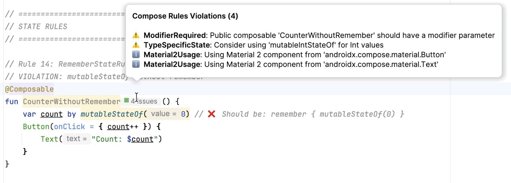
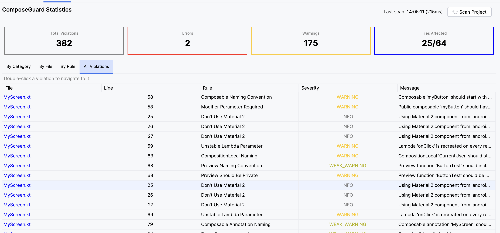
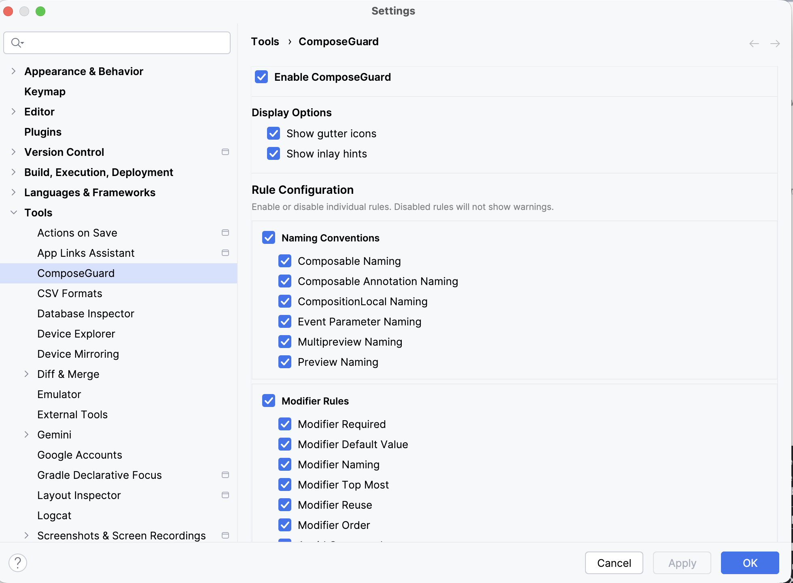

<p align="center">
  
</p>

<h1 align="center">ComposeGuard</h1>

<p align="center">
  <a href="https://plugins.jetbrains.com/plugin/29308-composeguard"></a>
  <a href="https://plugins.jetbrains.com/plugin/29308-composeguard"></a>
  <a href="https://opensource.org/licenses/Apache-2.0"></a>
  <a href="https://github.com/androidpoet"></a>
  <a href="https://androidweekly.net/issues/issue-705"></a>
</p>

<p align="center">
  <b>Catch Jetpack Compose mistakes as you type</b> — 36 best-practice rules from the
  <a href="https://mrmans0n.github.io/compose-rules/">Compose Rules</a> guidelines, surfaced live in
  Android Studio &amp; IntelliJ IDEA with inline highlights, gutter icons, and one-click fixes.
</p>

---

## Preview

<p align="center">
  
</p>

## Why ComposeGuard?

The [Compose Rules](https://mrmans0n.github.io/compose-rules/) catch the subtle mistakes that hurt
Compose code — missing `Modifier` parameters, un-remembered state, unstable collections, reused
modifiers, and dozens more. ComposeGuard brings those checks **into the editor**, so you fix them
while the code is still fresh instead of discovering them in a build log or a code review.

- ⚡ **Instant** — analysis runs as you type; no build, no Gradle task, no CI round-trip.
- 🎯 **Accurate** — rules are PSI-based and tuned to avoid false positives on valid patterns
  (overrides, scoped slots, mutually-exclusive branches, run-once effects, …).
- 🛠 **Actionable** — most violations come with a quick fix (<kbd>Alt</kbd>+<kbd>Enter</kbd>) and a
  detailed explanation of *why* it matters.
- 🎚 **Configurable** — enable/disable any rule or whole category, or suppress per declaration.

## Table of Contents

- [Features](#features)
- [Installation](#installation)
- [Quick Start](#quick-start)
- [Suppressing Rules](#suppressing-rules)
- [Rule Reference](#rule-reference)
- [Statistics Dashboard](#statistics-dashboard)
- [Configuration](#configuration)
- [Requirements &amp; Compatibility](#requirements--compatibility)
- [Contributing](#contributing)
- [Credits](#credits)
- [License](#license)

## Features

- **Real-time highlighting** — violations appear as colored underlines while you edit.
- **Gutter icons** — a color-coded dot per `@Composable` summarizes its status at a glance:
  - 🔴 Error &nbsp;&nbsp; 🟠 Warning &nbsp;&nbsp; ⚪ Weak warning &nbsp;&nbsp; 🔵 Info
- **Inline hints** — compact badges next to function names show rule violations.
- **Hover tooltips** — every violation explains the problem, the reasoning, and the fix.
- **Quick fixes** — rename, add a `modifier` parameter, wrap in `remember`, switch to a type-specific
  state, make a preview private, swap to an immutable collection, and more.
- **36 rules across 6 categories** — see the full [Rule Reference](#rule-reference).

## Installation

<a href="https://plugins.jetbrains.com/plugin/29308-composeguard"></a>

1. Open **Android Studio** or **IntelliJ IDEA**.
2. Go to **Settings** → **Plugins** → **Marketplace**.
3. Search for **ComposeGuard**.
4. Click **Install** and restart when prompted.

Or install directly from the [JetBrains Marketplace](https://plugins.jetbrains.com/plugin/29308-composeguard).

## Quick Start

Once installed, ComposeGuard automatically analyzes any Kotlin file containing `@Composable`
functions — no configuration required. Here are a few things it catches:

```kotlin
// 🟠 Naming: Unit-returning composables should be PascalCase
@Composable
fun userCard(user: User) { }              // → rename to "UserCard"

// 🟠 Modifier: public UI composables should expose a Modifier
@Composable
fun ProductCard(product: Product) {       // → add `modifier: Modifier = Modifier`
    Column { Text(product.name) }
}

// 🔴 State: state must be remembered
@Composable
fun Counter() {
    val count = mutableStateOf(0)         // → wrap in remember { }
}

// 🟠 Stricter: prefer stable collections
@Composable
fun ItemList(items: List<Item>) { }       // → use ImmutableList<Item>
```

Hover any highlight for the full explanation, or press <kbd>Alt</kbd>+<kbd>Enter</kbd> to apply a fix.

## Suppressing Rules

To intentionally allow a violation, annotate the declaration with `@Suppress` using the **rule id**
(the same id shown in the warning, e.g. `ModifierRequired`). The quick fix can insert this for you:

```kotlin
@Suppress("ModifierRequired")
@Composable
fun SplashLogo() {
    Image(painterResource(R.drawable.logo), contentDescription = null)
}

// Multiple rules at once:
@Suppress("ModifierRequired", "ComposableNaming")
@Composable
fun splash() { /* ... */ }
```

Suppression works at the function, property, or class level. To turn rules off project-wide instead,
use [Configuration](#configuration).

## Rule Reference

ComposeGuard ships **36 rules** based on the [Compose Rules](https://mrmans0n.github.io/compose-rules/)
guidelines. Severity legend: 🔴 Error · 🟠 Warning · ⚪ Weak warning · 🔵 Info.

### Naming

| Rule id | Checks | Severity |
|---------|--------|:--------:|
| `ComposableNaming` | Unit-returning composables use PascalCase; value-returning use camelCase | 🟠 |
| `CompositionLocalNaming` | `CompositionLocal` properties are prefixed with `Local` | 🟠 |
| `PreviewNaming` | `@Preview` functions reference `Preview` in their name | ⚪ |
| `MultipreviewNaming` | Multipreview annotation classes reference `Preview` | ⚪ |
| `ComposableAnnotationNaming` | `@ComposableTargetMarker` annotations end with `Composable` | ⚪ |
| `EventParameterNaming` | Event lambdas use present tense (`onClick`, not `onClicked`) | ⚪ |

### Modifiers

| Rule id | Checks | Severity |
|---------|--------|:--------:|
| `ModifierRequired` | Public, UI-emitting composables expose a `Modifier` parameter | 🟠 |
| `ModifierDefaultValue` | `modifier` parameters default to `Modifier` | 🟠 |
| `ModifierNaming` | The main modifier is named `modifier`; others follow `xModifier` | ⚪ |
| `ModifierTopMost` | The modifier is applied to the root-most layout | 🟠 |
| `ModifierReuse` | The same modifier isn't applied to multiple live nodes | 🟠 |
| `ModifierOrder` | Modifier chain order is intentional (e.g. `padding` before `clickable`) | 🟠 |
| `AvoidComposed` | Prefer `Modifier.Node` over the deprecated `composed { }` factory | 🟠 |

### State

| Rule id | Checks | Severity |
|---------|--------|:--------:|
| `RememberState` | `mutableStateOf` and friends are wrapped in `remember { }` | 🔴 |
| `TypeSpecificState` | Primitives use `mutableIntStateOf` / `mutableFloatStateOf` / … | 🟠 |
| `DerivedStateOfCandidate` | Values computed from state use `derivedStateOf` | 🟠 |
| `FrequentRecomposition` | Hot observable sources use lifecycle-aware collection | 🟠 |
| `DeferStateReads` | Fast-changing state reads are deferred to lambda modifiers | 🟠 |
| `HoistState` | State is hoisted to the appropriate level | 🔵 |
| `MutableStateParameter` | Pass `value` + callback instead of a `MutableState` parameter | 🟠 |

### Parameters

| Rule id | Checks | Severity |
|---------|--------|:--------:|
| `ParameterOrdering` | Order is required → `modifier` → optional → trailing content | ⚪ |
| `TrailingLambda` | The content slot is the trailing lambda; event handlers are not | ⚪ |
| `MutableParameter` | Avoid inherently mutable types (`MutableList`, `ArrayList`, …) as parameters | 🟠 |
| `ExplicitDependencies` | Make injected ViewModels explicit parameters | ⚪ |
| `ViewModelForwarding` | Don't forward a ViewModel into another composable | 🟠 |

### Composables &amp; Effects

| Rule id | Checks | Severity |
|---------|--------|:--------:|
| `ContentEmission` | A composable emits content **or** returns a value, not both | 🟠 |
| `MultipleContentEmitters` | A composable emits a single piece of content | 🟠 |
| `ContentSlotReused` | A content slot isn't invoked more than once on the same pass | 🟠 |
| `EffectKeys` | Changing captured values are passed as effect keys | 🟠 |
| `LambdaParameterInEffect` | Lambda parameters used in effects are wrapped in `rememberUpdatedState` | 🟠 |
| `MovableContent` | `movableContentOf` is remembered | 🔴 |
| `PreviewVisibility` | `@Preview` composables are `private` | 🟠 |
| `LazyListMissingKey` | Lazy list items provide a stable `key` | 🟠 |
| `LazyListContentType` | Heterogeneous lazy lists set a `contentType` | 🔵 |

### Stricter

| Rule id | Checks | Severity |
|---------|--------|:--------:|
| `UnstableCollections` | Prefer `ImmutableList` / `PersistentList` over `List`, `Set`, `Map` | 🟠 |
| `Material2Usage` | Migrate `androidx.compose.material` (M2) imports to Material 3 | 🔵 |

> Suppress any rule with `@Suppress("<RuleId>")`, or toggle it in **Settings → Tools → ComposeGuard**.

## Statistics Dashboard

ComposeGuard includes a tool window that tracks rule violations across your project.

<p align="center">
  
</p>

- **Real-time statistics** — violation counts update as you code.
- **Category breakdown** — see violations grouped by rule category.
- **Rule-level details** — drill into specific rules.
- **Project overview** — track overall code-quality trends.

Open it from **View** → **Tool Windows** → **ComposeGuard Statistics**.

## Configuration

Configure ComposeGuard at **Settings** → **Tools** → **ComposeGuard**.

<p align="center">
  
</p>

- **Enable ComposeGuard** — master toggle for the whole plugin.
- **Display options** — toggle gutter icons and inlay hints.
- **Rule configuration** — enable/disable individual rules or entire categories.

### Adopting ComposeGuard in an existing codebase

Adding the plugin to a large legacy project? Roll it out gradually instead of facing every warning at once:

1. Start with the **Stricter** category off (`Material2Usage`, `UnstableCollections`).
2. Enable categories one at a time as you refactor — the category checkbox toggles the whole group.
3. Use `@Suppress("<RuleId>")` for individual, intentional exceptions.

## Requirements &amp; Compatibility

- **IntelliJ IDEA 2024.2+** or **Android Studio Ladybug (2024.2)+**
- The bundled **Kotlin** plugin (enabled by default)

| ComposeGuard | Supported IDE builds |
|--------------|----------------------|
| 1.2.x | 2024.2 – 2026.2 |

## Contributing

Contributions are welcome — issues and pull requests both.

1. Fork the repository.
2. Create a feature branch: `git checkout -b feature/amazing-feature`.
3. Make your change and add tests (`./gradlew :compose-guard:test`).
4. Commit and push, then open a Pull Request.

## Credits

Built on the excellent [Compose Rules](https://mrmans0n.github.io/compose-rules/) guidelines by
[Nacho Lopez (mrmans0n)](https://github.com/mrmans0n).

## License

```
Designed and developed by 2025 androidpoet (Ranbir Singh)

Licensed under the Apache License, Version 2.0 (the "License");
you may not use this file except in compliance with the License.
You may obtain a copy of the License at

   http://www.apache.org/licenses/LICENSE-2.0

Unless required by applicable law or agreed to in writing, software
distributed under the License is distributed on an "AS IS" BASIS,
WITHOUT WARRANTIES OR CONDITIONS OF ANY KIND, either express or implied.
See the License for the specific language governing permissions and
limitations under the License.
```

---

<p align="center">
Made with ❤️ by <a href="https://github.com/androidpoet">androidpoet</a>
</p>
